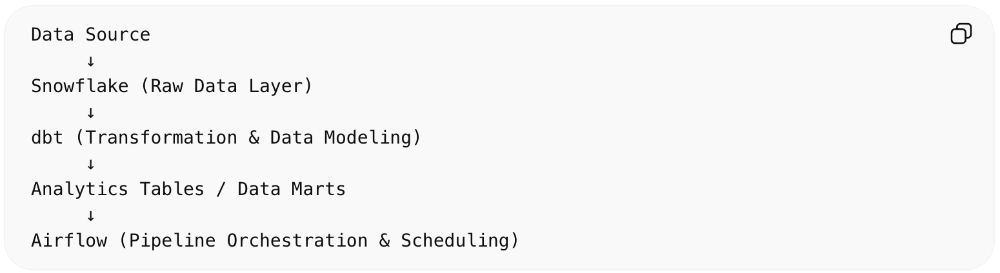

Project Overview

This project demonstrates how to build a modern ELT (Extract–Load–Transform) analytics engineering pipeline using dbt, Snowflake, and Apache Airflow. The pipeline loads raw data into Snowflake, transforms it using dbt models, and orchestrates the entire workflow using Airflow DAGs.

The goal of this project is to replicate a real-world analytics engineering workflow, where raw data is transformed into analytics-ready datasets such as staging tables, fact tables, and data marts that can be used by BI tools or downstream analytics applications.

 

How to Run the Pipeline
1. Setup Snowflake
Create a warehouse, database, and schema in Snowflake.

2. Configure dbt
Update your profiles.yml file with Snowflake credentials.

3. Run dbt Models: dbt run
4. Start Airflow: airflow webserver amd airflow scheduler
5. Trigger DAG: Run the dbt_pipeline_dag from the Airflow UI to orchestrate the pipeline